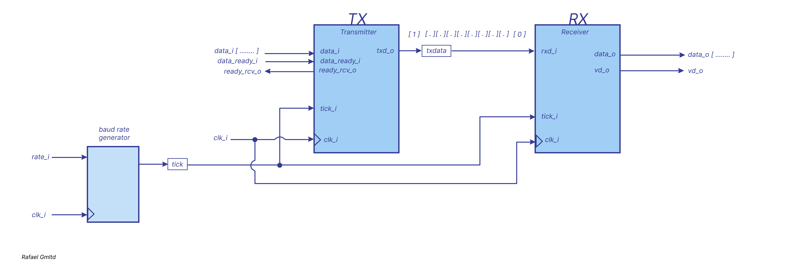

# *UART*

There are several methods for data transfer between a PC and an FPGA:

- Ethernet
- JTAG
- PCIe
- UART

In this case, we will focus on the last one — UART.

I'll make a brief digression from the main topic.
The Basys 3 board uses the FT2232HQ chip from FTDI.
This chip provides two independent channels:

- USB-UART — for serial data exchange between the PC and the FPGA.

- USB-JTAG — for programming the FPGA.

What the FT2232HQ does:

- Connects to the PC via a micro-USB cable.

- Converts USB to UART, allowing serial data communication with the PC (similar to a standard COM port).

- Uses TXD (transmit) and RXD (receive) signals to connect to FPGA pins B18 and A18, respectively.

- Virtual COM Port (VCP) drivers allow the PC to recognize this port as a standard COM port.

- The board has LEDs LD17 and LD18, which light up during data transmission or reception.

Although the same FT2232HQ chip is used for both programming (via JTAG) and UART communication, these channels operate independently.

All of this works through a single cable — powering the board, programming, and data transfer.

For more info check
[USB-UART Bridge (Serial Port)](https://digilent.com/reference/programmable-logic/basys-3/reference-manual?redirect=1)

A universal asynchronous receiver and transmitter (UART) is a circuit that sends parallel
data through a serial line.
A UART includes a transmitter and a receiver. The transmitter is essentially a special shift register that loads data in parallel 
and then shifts it out bit by bit at a specific rate.The receiver, on the other hand, shifts in data bit by bit and then reassembles the data. 
The serial line is 1 when it is idle. The transmission starts with a start bit, which is 0, followed by data bits and an optional parity bit, 
and ends with stop bits, which are 1.The optional parity bit is used for error detection. For odd parity, it is set to 0 when the data bits have an odd number of 1's. For even parity, it is set to 0 when the data bits have an even number of 1's. Note that the LSB of the data word is transmitted first.
No clock information is conveyed through the serial line. Before the transmission starts,the transmitter and receiver must agree on a set of parameters in advance, which include the
baud rate (i.e., number of bits per second), the number of data bits and stop bits, and use of the parity bit.

### Oversampling
Since clock signal information is not transmitted along with the data,
the receiver cannot determine when the first bit starts or when it should be sampled.
To handle this, an oversampling scheme is used to estimate the midpoints of the transmitted bits and extract them at those points.

The most commonly used oversampling rate is 16 times the baud rate. This means each serial data bit is sampled 16 times.

Let’s take a moment to break this down and understand the situation.
UART is a relatively slow data transmission method. For example, if the baud rate is 19,200, that means 19,200 bits are transmitted per second.
Now, suppose our system clock runs at 100 MHz — that’s 100 million clock cycles per second.
To find out how many system clock cycles correspond to one data bit, we divide:

100,000,000 / 19,200 ≈ 5208 system clocks per bit
So, one bit of UART data spans approximately 5208 system clock cycles.

We need a way to signal the receiver that a bit is ready to be read, somewhere within that window.
Ideally, we want to sample the bit in the middle of its duration.

UART data transmission starts with a start bit, which is always logic 0.
When the receiver detects this low signal, it starts counting oversampling ticks.

If we are oversampling at 16× the baud rate, that means:

- Each bit is divided into 16 sampling ticks.

- To hit the middle of the start bit, we count 8 ticks (from 0 to 7).

- After those 8 ticks, we're in the middle of the start bit.

From this point:

- After another 16 ticks, we’ll be in the middle of data bit 0.

- Another 16 ticks — middle of data bit 1, and so on.

- Let’s connect this to the system clock:

- We already know 1 bit = 5208 system clocks

With 16× oversampling, we divide 5208 by 16:

5208 / 16 ≈ 326 system clocks per tick

So the logic becomes:

- Wait for 8 ticks after detecting the start bit — we are in its center.

- Then, every 16 ticks after that will land us in the middle of the subsequent data bits.

- This timing allows the receiver to extract the bits accurately.

I also didn’t fully grasp all this on the first try — it's a lot of subtle timing logic to process.

### ASMD chart of a UART receiver

- The **DBIT** constant specifies the number of data bits.

- The **SB_TICK** constant indicates the number of ticks required for receiving the stop bits: 16, 24, and 32 for 1, 1.5, and 2 stop bits, respectively.
   *In this design, the values of DBIT and SB_TICK are set to 8 and 16, respectively.*

- The **s_tick** signal is the enable tick generated by the baud rate generator (there are 16 such ticks per bit interval).

- There are two counters represented by the s and n registers.

    - The **s register** tracks the number of sampling ticks: up to 7 in the start state, up to 15 in the data state, and up to SB_TICK in the stop state.

    - The **n** register keeps track of the number of received data bits in the data state.

- The received bits are shifted and assembled into the **b register**.

- The **rx_done_tick** status flag is asserted for one system clock cycle after the reception process is completed.

### UART RX

### UART TX

### UART RX TX

