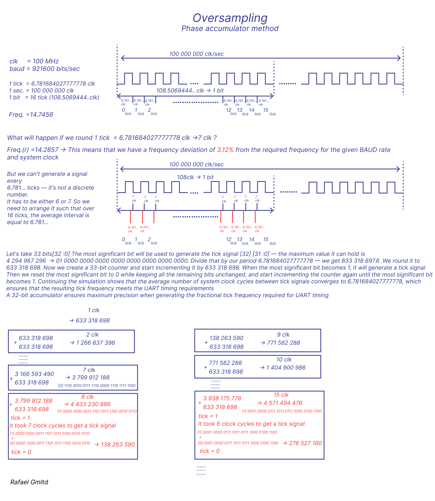
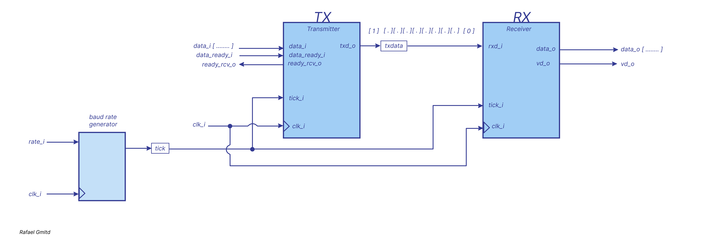
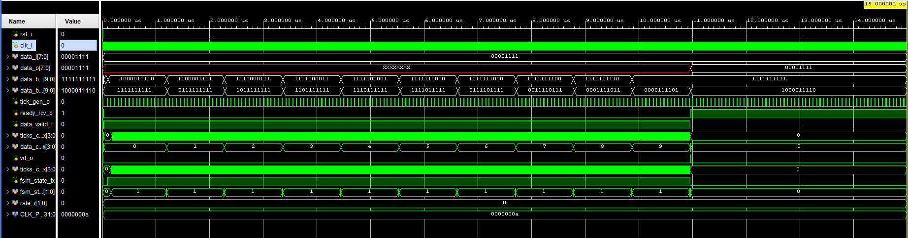

# *Oversampling Phase accumulator method*

For more info check

[Determining Clock Accuracy Requirements for UART Communications](https://www.analog.com/en/resources/technical-articles/determining-clock-accuracy-requirements-for-uart-communications.html)

# *Testbench*

