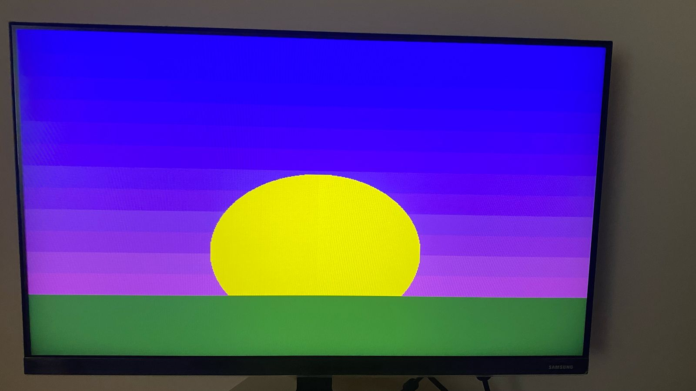

# Understanding VGA: How It Works and Its Standards  

## 1. VGA Signals 
#### check vga.sv 

VGA (Video Graphics Array) is an analog video standard that transmits images using separate RGB signals and synchronization signals.  

### Main VGA Signals  
- **Red (R)** — Analog intensity of the red color  
- **Green (G)** — Analog intensity of the green color  
- **Blue (B)** — Analog intensity of the blue color  
- **Horizontal Sync (HSYNC)** — Marks the end of a horizontal line  
- **Vertical Sync (VSYNC)** — Marks the end of a frame  

---

## 2. How VGA Displays an Image  

VGA works using a scanning system that draws the screen line by line:  

1. **Horizontal Scan**: The electron beam moves from left to right to draw a line.  
2. **Vertical Scan**: After each line, the beam moves down to the next row.  
3. **Complete Frame**: When all rows are drawn, the frame is complete, and the process repeats.  

### Synchronization Signals:  
- **HSYNC**: "Start a new line!"  
- **VSYNC**: "Start a new frame!"  

---

## 3. VGA Timing (Example: 640x480 @ 60Hz)  

VGA timing consists of different time intervals that define when pixels are drawn and when synchronization happens.

### Horizontal Timing (HSYNC)  
| Stage          | Pixels  | Description                 |
|---------------|---------|-----------------------------|
| Active pixels | 640     | Visible image               |
| Front porch   | 16      | Small delay before sync     |
| HSYNC pulse   | 96      | Horizontal sync signal      |
| Back porch    | 48      | Small delay after sync      |
| **Total**     | 800     | Complete horizontal cycle   |

### Vertical Timing (VSYNC)  
| Stage         | Lines   | Description                 |
|--------------|---------|-----------------------------|
| Active lines | 480     | Visible image               |
| Front porch  | 10      | Small delay before sync     |
| VSYNC pulse  | 2       | Vertical sync signal        |
| Back porch   | 33      | Small delay after sync      |
| **Total**    | 525     | Complete frame cycle        |

### Key Details  
- **Refresh rate**: 60 Hz (the screen refreshes 60 times per second).  
- **Pixel clock frequency**: 25.175 MHz.  

# Horizontal Scanning (hpos, H_SYNC)  
Horizontal scanning is responsible for how pixels are drawn in a single line.  

Each line consists of:  
- **640 pixels (visible area)** – the active image region.  
- **16 pixels (H_FRONT)** – short pause before HSync.  
- **96 pixels (H_SYNC)** – horizontal synchronization pulse.  
- **48 pixels (H_BACK)** – pause after HSync.  

These parameters define the structure of each scanline, ensuring proper image display.  

# Vertical Scanning (vpos, V_SYNC)  
Vertical scanning is responsible for transitioning to a new line and refreshing frames.  

## Frame Structure:  
- **480 lines (V_DISPLAY)** – visible frame area.  
- **10 lines (V_BOTTOM)** – pause before VSync.  
- **2 lines (V_SYNC)** – vertical synchronization pulse.  
- **33 lines (V_TOP)** – pause after VSync.  

These parameters define the frame height and the intervals between frames.  

# Pixel and Line Counters (hpos, vpos)  
This module updates the coordinates of the current pixel on the screen.  

## How does scanning move?  
- **hpos** increments from 0 to 799.  
- When **hpos** reaches 799, it resets to 0, and **vpos** increments.  
- When **vpos** reaches 524, it resets to 0, starting a new frame.  

The system follows a **line-by-line scanning principle**, where a new line starts after the previous one is completed. Once all lines are scanned, the frame refreshes.  

# Clock Frequency Division  
The VGA controller requires a specific **pixel clock frequency (pixel_clk)**.  

- For a **640×480** resolution, standard VGA requires **25.175 MHz**.  
- In FPGA, the system clock frequency (**clk**) can be, for example, **50 MHz** or **100 MHz**.  
- To obtain the required **pixel_clk**, a clock divider .  

# VGA Color Channels  
In VGA, each pixel on the screen is formed by a combination of three colors:  
- **Red**  
- **Green**  
- **Blue**  

These three colors are called **RGB components**, and each color is encoded with a certain number of bits.  

Each pixel on the screen consists of three tiny lights (or LEDs): one emitting **red**, another **green**, and the third **blue**.  

## How is color formed?  
- If all three lights are at full brightness (255, 255, 255), the color is **white**.  
- If all three lights are off (0, 0, 0), the color is **black**.  
- Different brightness levels of each color create various shades.  

## Example: **8-bit Color (RGB888)**  
- **Red (R)** → 8 bits (values from 0 to 255).  
- **Green (G)** → 8 bits (values from 0 to 255).  
- **Blue (B)** → 8 bits (values from 0 to 255).  

### Total:  
A total of **24 bits (8+8+8)**, allowing for **16,777,216 colors (2^24)**.  

## More Bits = Smoother Colors  
The higher the number of bits per channel, the more color gradations and smoother color transitions.  

# Defining Areas on the Screen  
The screen is represented as a **2D coordinate grid (x, y)**.  

- We select an area on the screen using **x, y** coordinates.  
- We assign brightness values to each of the three colors (**R, G, B**).  
- By combining **R, G, B**, any color can be created.  
- **Mathematical formulas** (such as circles, parabolas) can be used to create complex shapes.  

## How does it work?  
The system checks whether the current pixel belongs to a specific area and assigns it a color accordingly.  

Thus, the VGA controller manages **scanning, clock frequency, and color processing**, forming an image on the screen.  

